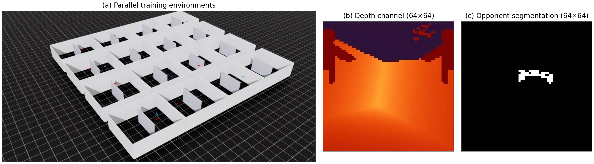
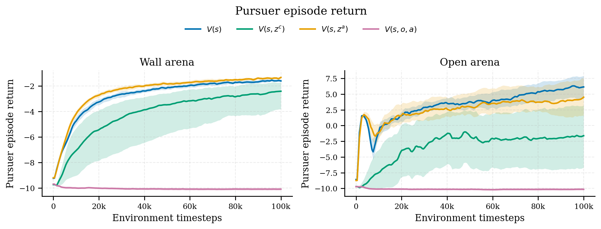

<div align="center">

# Memory-State Critic

**Give the critic the policy's own memory — not a second recurrent encoder.**

Reference implementation for *"Memory-State Critic for Asymmetric Actor-Critic with
Application to Vision-Based Pursuit-Evasion"*, EWRL 2026.

[](https://github.com/LouetteArthur/MemoryStateCritic/actions/workflows/tests.yml)
[](LICENSE)
[](install.sh)
[](https://developer.nvidia.com/isaac-sim)

</div>



## The idea in one paragraph

In a POMDP, a critic that sees only the privileged state `s` is generally ill-defined and
gives biased policy gradients. The usual fix — the **history-state critic** `V(s, z^c)` —
restores both, but pays for a *second* recurrent encoder trained from the value loss alone.
We show that conditioning on the state and the **policy's own memory** `z^a`, the hidden
state the actor already computes to choose its action, is enough: `V(s, z^a)` is
well-defined and unbiased. One recurrent encoder instead of two, and the value loss never
has to be backpropagated into it.

## Results

Vision-based pursuit-evasion between two quadrotors, 20 seeds per cell, 160 runs.
Capture rate at the end of training (interquartile mean):

| Critic | | Wall arena | Open arena |
|---|---|---:|---:|
| State-only | `V(s)` | 35.6 % | **62.0 %** |
| History-state (Baisero & Amato, 2022) | `V(s, z^c)` | 27.9 % | 29.7 % |
| **Memory-state (ours)** | **`V(s, z^a)`** | **36.5 %** | 54.8 % |
| Observation-state | `V(s, o, a)` | 0.7 % | 0.8 % |

The memory-state critic beats the history-state baseline in both arenas and converges
faster. Against the state-only critic it wins where occlusion makes the state alias the
history (wall: ΔIQM = +0.009, 95 % CI [+0.004, +0.014]) and is statistically
indistinguishable where it does not (open: CI straddles zero) — which is what the analysis
predicts.

<p align="center">
  
</p>

## Quick start

```bash
git clone https://github.com/LouetteArthur/MemoryStateCritic.git
cd MemoryStateCritic
./install.sh                 # .venv with Python 3.11, Isaac Sim 5.1, Isaac Lab, skrl, this package
source .venv/bin/activate
```

Requires Ubuntu 22.04/24.04, an NVIDIA GPU (driver ≥ 535, CUDA 12.x) and Git LFS.

Train the memory-state critic for one seed in the open arena:

```bash
OMNI_KIT_ACCEPT_EULA=YES python scripts/skrl/train.py \
    --task Ablation-vision-vs-trajectories \
    --agent skrl_ppo_vision_rnn_sz_cfg_entry_point \
    --sensor-mode both --num-past-actions 1 --seed 42 \
    --num_envs 512 --total_frames 51200000 --headless --enable_cameras
# wall arena: add --enable-obstacles --discount-factor=0.999
```

**Regenerate the paper's figures with no GPU and no wandb account** — the plotted series
for all 160 runs ship in the repository:

```bash
python scripts/plot_ablation_results.py --paper \
    --cache figures/paper/runs.pkl --output-dir /tmp/figures
```

## The critics

> [!IMPORTANT]
> **The code labels predate the paper's notation and do not read the way you would guess.**
> `Vsz` is the contribution; `Vsh` is the baseline. Swapping them silently runs the wrong
> experiment.

| Paper | Symbol | Code | `--agent ...` | Critic input |
|---|---|---|---|---|
| State-only | `V(s)` | `Vs` | `skrl_ppo_vision_rnn_cfg_entry_point` | privileged state |
| History-state | `V(s, z^c)` | `Vsh` | `skrl_ppo_vision_rnn_sh_cfg_entry_point` | state + a **second** CNN+GRU on the critic side |
| **Memory-state (ours)** | **`V(s, z^a)`** | `Vsz` | `skrl_ppo_vision_rnn_sz_cfg_entry_point` | state + the **actor's** GRU hidden state, stop-gradient |
| Observation-state | `V(s, o, a)` | `Vsoa` | `skrl_ppo_vision_rnn_geles_cfg_entry_point` | state + image + past actions (add `--unbiased-critic`) |

All four share the same CNN+GRU actor reading a 64×64 depth channel, a 64×64 opponent
segmentation mask and one past action. Only the critic head changes.
`skrl_ppo_vision_rnn_symmetric_cfg_entry_point` (`Vo`, actor observations only) is
implemented but not part of the paper.

## Reproducing the paper

```bash
./scripts/reproduce_paper.sh --dry-run    # print the 160 training commands
./scripts/reproduce_paper.sh              # run them
```

4 critics × 2 arenas × 20 seeds, the same seed set in every cell so the comparison is
paired. Each run is 5.12 × 10⁷ environment steps, about 5.5 h on an RTX 4090 — roughly
**37 GPU-days** for the full grid. Runs are sequential and write completion markers, so an
interrupted sweep resumes where it stopped; split the grid across machines with
`--critics` / `--arena`.

[**REPRODUCING.md**](REPRODUCING.md) is the authoritative document: exact seeds, settings,
hyperparameters, the naming map above, offline figure regeneration, a Docker recipe that
pins the whole stack, and a **Known limitations** section stating what we would fix given
more time.

## Repository layout

```
source/isaac_pursuit_evasion/
  isaac_pursuit_evasion/
    tasks/direct/pursuit_evasion/   PursuitEvasionEnv, its config, the critic YAMLs
    skrl_ext/                       asymmetric recurrent PPO on top of skrl
  assets/ dynamics/ controllers/    Crazyflie assets, propeller dynamics, heuristic evaders
source/third_parties/skrl/          vendored skrl 1.4.3 fork (see FORK_NOTES.md)
scripts/
  skrl/train.py  skrl/play.py       train / visualise a checkpoint
  reproduce_paper.sh                the paper's exact grid
  run_ablation.sh                   one cell of it
  plot_ablation_results.py          regenerate the figures
figures/paper/                      the plotted series for all 160 runs + the paper figures
tests/                              77 tests, no simulator needed
```

The environment, the critic variants and the plotting scripts are a curated slice of a
larger codebase. The self-play league, the multi-agent environments, the Elo tournament and
the Crazyswarm flight scripts are not shipped here. `deployment/` and some staged-training
plumbing remain because the paper's import path reaches them; no experiment uses them.

## Development

```bash
pytest tests/                       # all 77, ~4 min, no Isaac Sim (conftest.py stubs it)
pytest tests/ -m "not stochastic"   # the 75 deterministic ones, ~7 s — what CI runs
pre-commit run --all-files          # black, isort, flake8, pyupgrade, codespell
```

Two tests train PPO end to end on a toy POMDP and assert a threshold on how much it
improves. They are worth running — they catch a broken BPTT or dead gradients — but the
outcome depends on the BLAS backend and thread count, so they are marked `stochastic` and
excluded from CI rather than left to fail there intermittently.

## Citation

```bibtex
@inproceedings{memorystatecritic2026,
  title     = {Memory-State Critic for Asymmetric Actor-Critic with
               Application to Vision-Based Pursuit-Evasion},
  author    = {Louette, Arthur and S{\'a}nchez Roncero, Alejandro and
               Lambrechts, Gaspard and Leroy, Pascal and Hansen, Julien and
               {\"O}gren, Petter and Ernst, Damien},
  booktitle = {European Workshop on Reinforcement Learning (EWRL)},
  year      = {2026}
}
```

Machine-readable metadata: [CITATION.cff](CITATION.cff).

## License

[BSD 3-Clause](LICENSE). Third-party components are listed in [NOTICE](NOTICE); in
particular this repository vendors a **modified** copy of
[skrl](https://github.com/Toni-SM/skrl) 1.4.3 (MIT) under `source/third_parties/`, with the
exact delta in [`skrl_1.4.3.patch`](source/third_parties/skrl/skrl_1.4.3.patch).

## Acknowledgements

Claude (Anthropic) assisted with parts of the code, under the authors' direction and
review. The research contribution and the reported results are the authors'.
