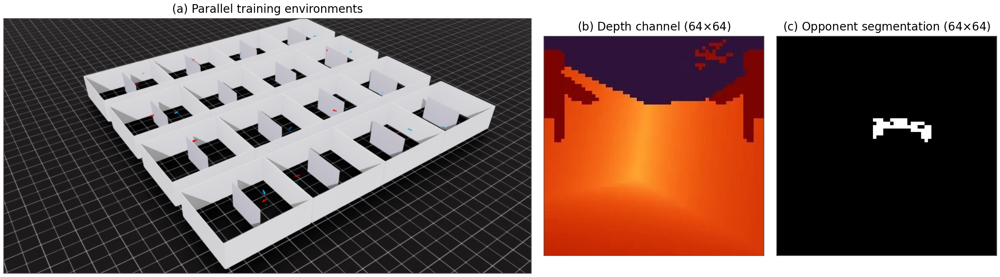
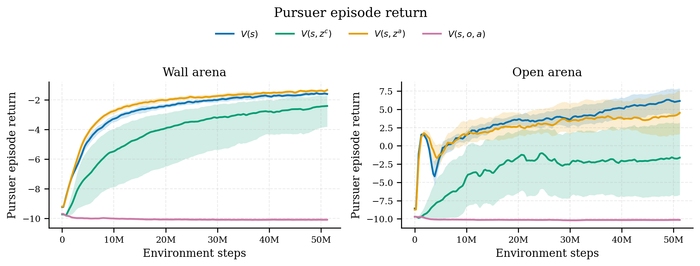

<div align="center">

# Memory-State Critic

**Give the critic the policy's own memory — not a second recurrent encoder.**

Reference implementation for *"Memory-State Critic for Asymmetric Actor-Critic with
Application to Vision-Based Pursuit-Evasion"*, EWRL 2026.

Arthur Louette, Alejandro Sánchez Roncero, Gaspard Lambrechts, Pascal Leroy,
Julien Hansen, Petter Ögren, Damien Ernst

**[Paper](https://openreview.net/forum?id=iKiJUMvYT7)** ·
**[PDF](https://openreview.net/pdf?id=iKiJUMvYT7)** ·
**[BibTeX](#citation)**

[](https://openreview.net/forum?id=iKiJUMvYT7)
[](https://github.com/LouetteArthur/MemoryStateCritic/actions/workflows/tests.yml)
[](LICENSE)
[](install.sh)
[](https://developer.nvidia.com/isaac-sim)

</div>



## The idea in one paragraph

In a POMDP, a critic that sees only the privileged state `s` is generally ill-defined and
gives biased policy gradients. The usual fix — the **history-state critic** `V(s, z^c)` —
restores both, but pays for a *second* recurrent encoder trained from the value loss alone.
We show that conditioning on the state and the **policy's own memory** `z^a`, the hidden
state the actor already computes to choose its action, is enough: `V(s, z^a)` is
well-defined and unbiased. One recurrent encoder instead of two, and the value loss never
has to be backpropagated into it.

In code, the whole method is one line in the critic:

```python
z_a, _ = actor.f_theta(torch.cat([obs, prev_action], dim=-1))  # the policy's memory
value = v_psi(torch.cat([state, z_a.detach()], dim=-1))        # stop-gradient: f_theta stays out of the value loss
```

[`minimal/memory_state_critic.py`](minimal/memory_state_critic.py) is a self-contained
PyTorch version, with the history-state baseline next to it, that runs without the simulator.

## Results

Vision-based pursuit-evasion between two quadrotors, 20 seeds per cell, 160 runs.
Capture rate at the end of training (interquartile mean):

| Critic | | Wall arena | Open arena |
|---|---|---:|---:|
| State-only | `V(s)` | 35.6 % | **62.0 %** |
| History-state (Baisero & Amato, 2022) | `V(s, z^c)` | 27.9 % | 29.7 % |
| **Memory-state (ours)** | **`V(s, z^a)`** | **36.5 %** | 54.8 % |
| Observation-state | `V(s, o, a)` | 0.7 % | 0.8 % |

The memory-state critic beats the history-state baseline in both arenas and converges
faster. Against the state-only critic it wins where occlusion makes the state alias the
history (wall: ΔIQM = +0.009, 95 % CI [+0.004, +0.014]) and is statistically
indistinguishable where it does not (open: CI straddles zero) — which is what the analysis
predicts.

<p align="center">
  
</p>

## Quick start

```bash
git clone https://github.com/LouetteArthur/MemoryStateCritic.git
cd MemoryStateCritic
./install.sh                 # .venv with Python 3.11, Isaac Sim 5.1, Isaac Lab, skrl, this package
source .venv/bin/activate
```

Requires Ubuntu 22.04/24.04, an NVIDIA GPU (driver ≥ 535, CUDA 12.x) and Git LFS.

Train the memory-state critic for one seed in the open arena:

```bash
OMNI_KIT_ACCEPT_EULA=YES python scripts/skrl/train.py \
    --task Ablation-vision-vs-trajectories \
    --agent skrl_ppo_memory_state_critic_cfg_entry_point \
    --sensor-mode both --num-past-actions 1 --seed 42 \
    --num_envs 512 --total_frames 51200000 --headless --enable_cameras
# wall arena: add --enable-obstacles --discount-factor=0.999
```

**Regenerate the paper's figures with no GPU and no wandb account** — the plotted series
for all 160 runs ship in the repository:

```bash
python scripts/plot_ablation_results.py --paper \
    --cache figures/paper/runs.pkl --output-dir /tmp/figures
```

## The critics

| Paper | Symbol | `--agent skrl_ppo_<…>_cfg_entry_point` | Critic input |
|---|---|---|---|
| State-only | `V(s)` | `state_critic` | privileged state |
| History-state | `V(s, z^c)` | `history_state_critic` | state + a **second** CNN+GRU on the critic side |
| **Memory-state (ours)** | **`V(s, z^a)`** | `memory_state_critic` | state + the **actor's** GRU hidden state, stop-gradient |
| Observation-state | `V(s, o, a)` | `observation_state_critic` | state + image + past action (add `--unbiased-critic`) |

All four share the same CNN+GRU actor reading a 64×64 depth channel, a 64×64 opponent
segmentation mask and one past action. Only the critic changes: the memory-state critic is
[`memory_state_critic.py`](source/isaac_pursuit_evasion/isaac_pursuit_evasion/skrl_ext/models/memory_state_critic.py),
the baseline is
[`history_state_critic.py`](source/isaac_pursuit_evasion/isaac_pursuit_evasion/skrl_ext/models/history_state_critic.py),
and one agent, `PPO_RNN_ASYM`, trains all of them. `symmetric_critic` (`V(o, a)`, actor
observations only) is implemented but not part of the paper.

The runs behind the paper were logged under older labels (`Vs`, `Vsh`, `Vsz`, `Vsoa`); the
old names are still accepted everywhere, and [REPRODUCING.md](REPRODUCING.md#1-the-critics-in-the-code)
maps them.

## Reproducing the paper

```bash
./scripts/reproduce_paper.sh --dry-run    # print the 160 training commands
./scripts/reproduce_paper.sh              # run them
```

4 critics × 2 arenas × 20 seeds, the same seed set in every cell so the comparison is
paired. Each run is 5.12 × 10⁷ environment steps, about 5.5 h on an RTX 4090 — roughly
**37 GPU-days** for the full grid. Runs are sequential and write completion markers, so an
interrupted sweep resumes where it stopped; split the grid across machines with
`--critics` / `--arena`.

[**REPRODUCING.md**](REPRODUCING.md) is the authoritative document: exact seeds, settings,
hyperparameters, the mapping to the older critic names, offline figure regeneration,
and a Docker recipe that pins the whole stack.

## Repository layout

```
source/isaac_pursuit_evasion/
  isaac_pursuit_evasion/
    tasks/direct/pursuit_evasion/   PursuitEvasionEnv, its config, the critic YAMLs
    skrl_ext/                       the critics and asymmetric recurrent PPO, on top of skrl
  assets/ dynamics/ controllers/    Crazyflie assets, propeller dynamics, heuristic evaders
source/third_parties/skrl/          vendored skrl 1.4.3 fork (see FORK_NOTES.md)
minimal/                            the method in plain PyTorch, no simulator
scripts/
  skrl/train.py  skrl/play.py       train / visualise a checkpoint
  reproduce_paper.sh                the paper's exact grid
  run_ablation.sh                   one cell of it
  plot_ablation_results.py          regenerate the figures
figures/paper/                      the plotted series for all 160 runs + the paper figures
tests/                              50 tests, no simulator needed
```

The environment, the critic variants and the plotting scripts are a curated slice of a
larger codebase. The self-play league, the multi-agent environments, the Elo tournament and
the Crazyswarm flight scripts are not shipped here. `deployment/` and the environment's
opponent plumbing remain because the environment's import path reaches them; no experiment
uses them.

## Development

```bash
pytest tests/                       # all 50, several minutes, no Isaac Sim (conftest.py stubs it)
pytest tests/ -m "not stochastic"   # the 48 deterministic ones, ~2 s — what CI runs
pre-commit run --all-files          # black, isort, flake8, pyupgrade, codespell
```

Two tests train PPO end to end on a toy POMDP and assert a threshold on how much it
improves. They are worth running — they catch a broken BPTT or dead gradients — but the
outcome depends on the BLAS backend and thread count, so they are marked `stochastic` and
excluded from CI rather than left to fail there intermittently.

## Citation

If you use this code or build on the memory-state critic, please cite:

```bibtex
@inproceedings{louette2026memorystate,
  title     = {Memory-State Critic for Asymmetric Actor-Critic with
               Application to Vision-Based Pursuit-Evasion},
  author    = {Louette, Arthur and S{\'a}nchez Roncero, Alejandro and
               Lambrechts, Gaspard and Leroy, Pascal and Hansen, Julien and
               {\"O}gren, Petter and Ernst, Damien},
  booktitle = {European Workshop on Reinforcement Learning (EWRL)},
  year      = {2026},
  url       = {https://openreview.net/forum?id=iKiJUMvYT7}
}
```

Machine-readable metadata: [CITATION.cff](CITATION.cff).

## License

[BSD 3-Clause](LICENSE). Third-party components are listed in [NOTICE](NOTICE); in
particular this repository vendors a **modified** copy of
[skrl](https://github.com/Toni-SM/skrl) 1.4.3 (MIT) under `source/third_parties/`, with the
exact delta in [`skrl_1.4.3.patch`](source/third_parties/skrl/skrl_1.4.3.patch).

## Acknowledgements

Claude (Anthropic) assisted with parts of the code, under the authors' direction and
review. The research contribution and the reported results are the authors'.
